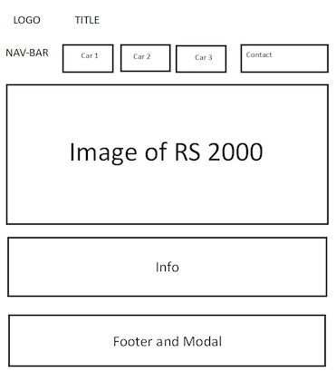
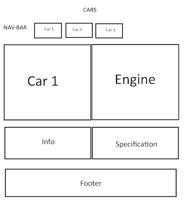

# MileStone Project 1 Created by Mark Curran

# **https://curran68-escort2-r2ngbkmkc8b.ws-eu110.gitpod.io/**

# Introduction

[**Site Overview**](#site-overview)

**mac1968 Ford MK2 RS Escorts** is my first website aimed at enthusiasts which highlights my liking of the 3 RS Models of this great car.

Created Using HTML, CSS and Bootstrap 4.3.1. with a hint of Java ....

In years gone by i have owned 5 of these cars and modified and upgraded to my liking.

As this is my first website i tried various layouts and designs, always trying 
to make it responsive and eyecatching, trying where i can to have a good structured layout.

Vehicles Covered

RS Mexico
 
RS 1800
 
RS 2000

***
**Design and User Experience**

This is my first full website project, consisting of four pages :-

Landing page
RS Mexico
RS 1800
RS 2000

Keeping the same layout/design for all pages. At the top of each indiviual page title/header,
nav-bar images to showcase the vehicles.
Information on each model, all including footer with contact info.
Throughout the project using HTML, CSS Bootstrap 4.3.1 and selective fonts courtesy of Google Fonts.
Whils`t aiming on keeping layout uniformed, kept same colour layout as i find these to be eyecatching and standout.
In the undertaking of this process i made several changes along the way using the command line tools Git.
Within the nav-bar i have included a contact modal code used from Bootstrap this i feel stands out.
Along the way i did encounter many issues in the layout and design, resolution and fixes were aided by the use of Dev. tools within Chrome.
Planning the website from the start i aimed for a responsive theme which has been regularly tested on a mobile device to check for issues and correct layout.

**Wireframes**
 

**Validation Tests**

