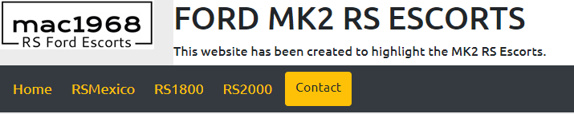
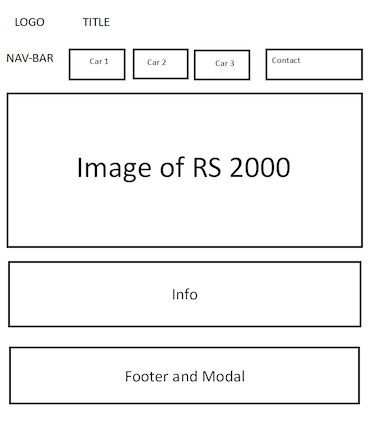
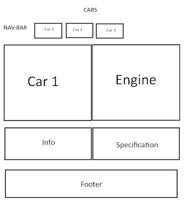
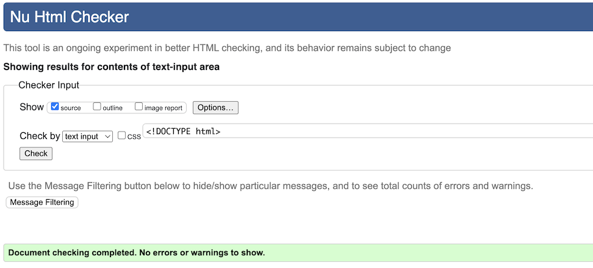
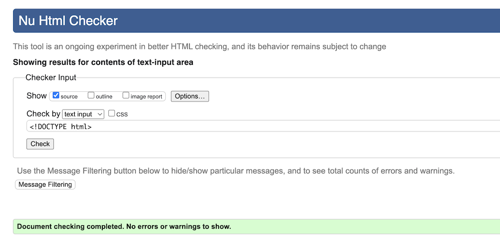
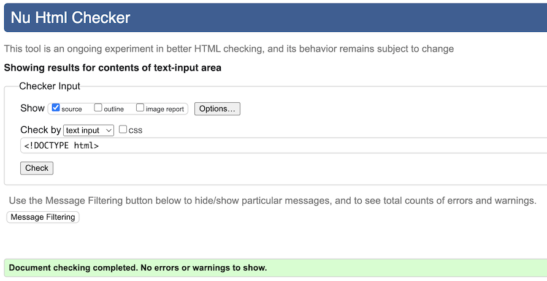
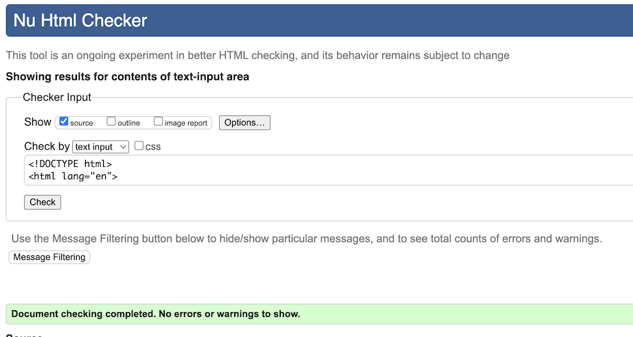
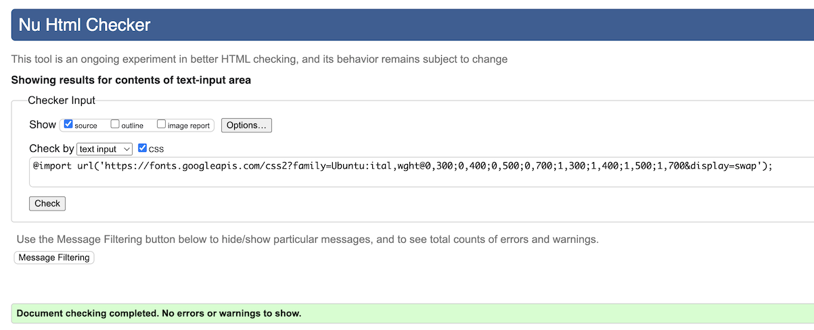
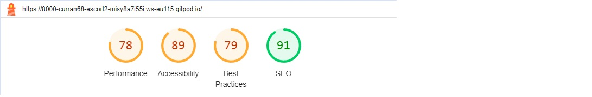

# MileStone Project 1 Created by Mark Curran - Ford MK2 RS Escorts

## *https://curran68.github.io/escort-2*

# Introduction

Site Overview

**mac1968 Ford MK2 RS Escorts** is my first website aimed at enthusiasts which highlights my liking of the 3 RS Models of this great car.

Created Using HTML, CSS and Bootstrap 4.3.1. with a hint of Java ....

Previously I have owned 5 of these cars and modified and upgraded each of them.

As this is my first website I tried various layouts and designs, always trying 
to make it responsive and eyecatching, trying where I can to have a good structured layout.

Vehicles Covered

RS Mexico
 
RS 1800
 
RS 2000

***
Design

This is my first full website project, consisting of four pages :-

Landing page,
RS Mexico,
RS 1800,
and RS 2000.

Keeping the same layout/design for all pages. At the top of each indiviual page title/header,
nav-bar images to showcase the vehicles.
I decided on a colour scheme which i feel not only stands out but is eyecatching, i followed the uniform colour/layout on all four pages.
At the top of the landing page i have designed a title, also a logo and a navbar.
This part of the landing page i have used HTML, CSS and Bootstrap this is where you can select the model type, or return back to the landing page.
On the navbar there is a contact button which sends you to an input form where you can submit your details, this was designed in Bootstrap which is a Modal.
Please note the navbar is fixed to the top of the landing page. 

Information on each model, all including footer with contact info.
Throughout the project using HTML, CSS Bootstrap 4.3.1 and selective fonts courtesy of Google Fonts.
Whilst aiming on keeping layout uniformed, kept same colour layout as i find these to be eyecatching and standout.
In the undertaking of this process i made several changes along the way using the command line tools Git.
Within the nav-bar i have included a contact modal code used from Bootstrap this i feel stands out.

***

Below are my wireframes which show my idea/layout.
**Wireframes**
 

Landing page

Model of car page

***

**Validation Tests**

## HTML - *https://validator.w3.org/nu/*

***

**Performance Test**
 

 

***

Along the way i did encounter many issues in the layout and design, resolution and fixes were aided by the use of Dev. tools within Chrome.
Planning the website from the start i aimed for a responsive theme which has been regularly tested on a mobile device to check for issues and correct layout.
I have also included on the landing page, above the footer a modal to select your favourite model.
This website has been tested in different browsers the se include :-

Google Chrome,
Mozilla Firefox,
Safari and 
Vivaldi.

Target audience:

Car enthusiasts who also have a keen interest in this great car.
Anywhere in the world it can be accessed.

User stories:

New user will be able to learn a little more about the different RS(rallye sport) models of this car.
New user will be able to navigate and look at the different models.
New user will be able to select the favourite of the three models covered.

My aims in this site:

To share my love of this great car.
To follow a responsive mobile first approach.
To use striking colours and layout.

 

During Development Testing
During the development process, I continually carried out manual testing in the following ways:-

Manually testing each element for appearance and responsiveness via Google Chrome dev tools.

Continually tested in multiple browsers.

Published the page via a web-hosted server and shared it with friends and family to test.

Manual Testing:
During testing, I used five different browsers to ensure cross-compatibility. The desktop browsers used myself were:

Chrome,
Firefox,
Vivaldi,
and Safari.

* Icons used are from [Font Awesome](https://www.fontawesome.com)
* All fonts were imported from [Google Fonts](https://fonts.google.com/)
* Car Images were imported from [Google Images](https://images.google.co.uk)

